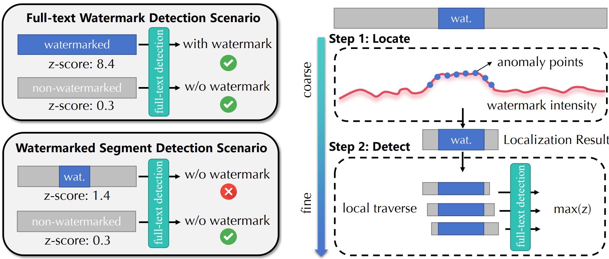
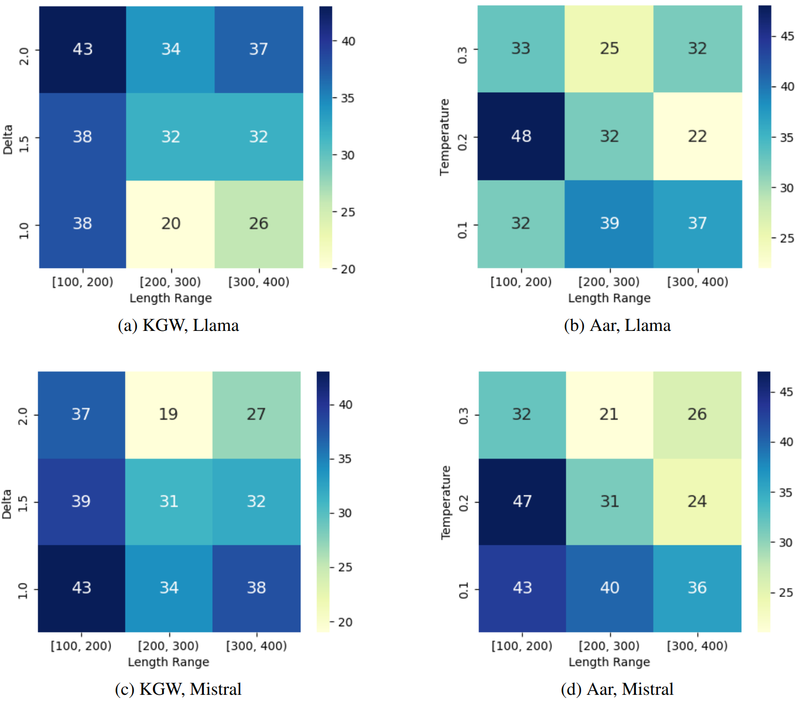

# WaterSeeker: Efficient Detection of Watermarked Segments in Large Documents


### Repo Contents

```
├── analysis                         # Analysis scripts
│   ├── fpr_simulation_aar.py        # False positive rate simulation for AAR
│   ├── fpr_simulation_kgw.py        # False positive rate simulation for KGW
│   ├── gold_is_the_best_aar.py      # Gold standard analysis for AAR
│   ├── gold_is_the_best_kgw.py      # Gold standard analysis for KGW
│   ├── num_samples_aar.py           # Plot sample distribution for AAR
│   └── num_samples_kgw.py           # Plot sample distribution for KGW
├── baselines                        # Baseline methods
│   ├── fix_window.py                
│   ├── full_text.py                 
│   └── winmax.py                    
├── config                           # Configuration files
│   ├── AAR.json                     
│   └── KGW.json                     
├── data                             # Data directory
│   ├── aar                          
│   │   ├── llama                    
│   │   │   └── data.json			 # Aar-llama dataset
│   │   └── mistral                  
│   │       └── data.json            # Aar-mistral dataset
│   ├── c4                           
│   │   └── processed_c4.json        # Processed C4 data
│   ├── kgw                          
│   │   ├── llama                    
│   │   │   └── data.json            # KGW-llama dataset
│   │   └── mistral                 
│   │       └── data.json            # KGW-mistral dataset
│   └── wikipedia                    
│       └── long_document.json       # Wikipedia data
├── evaluate.py                      # Evaluation script
├── fig/                             # Directory for figures
├── generate_data.py                 # Script to construct dataset
├── README.md                       
├── requirements.txt                 
├── script.sh                        
├── seeker                           
│   └── seeker.py                    # WaterSeeker Implementation
├── threshold_dict                   # Threshold dictionaries
│   ├── z_threshold_dict_1e6.json    
│   └── z_threshold_dict_5e7.json    
├── utils                            # Utility functions
│   ├── compute_z_threshold.py       
│   ├── success_rate_calculator.py   
│   ├── transformers_config.py      
│   └── utils.py                     
└── watermark                        # Watermarking algorithm implementations
    ├── aar.py                       
    ├── kgw.py                       
```

### Dataset Construction

#### Construct your own datasets

In this repository, we provide `generate_data.py` to assist users in constructing their own dataset. We use the C4 dataset as the corpus for prompts, instructing large language models to generate watermarked segments with lengths between `min_length` and `max_length`. We then use Wikipedia corpus as natural text and randomly insert the watermarked segments into a position within the natural text to construct the data. 

You can simply run the following command:

```shell
python generate_data.py --num_sample 300 --wiki_start_index 0 --prompt_start_index 0 --watermark kgw --key 33554393 --model llama --output_file data/kgw/llama/data_1.json
```

#### Use provided datasets

We provide the four datasets used in the main experiments: (under `data/`)

- KGW-llama  [key: 33554393]
- KGW-mistral [key: 4294967291]
- Aar-llama [seed: 42]
- Aar-mistral [seed: 42]

Each dataset employs different watermarking algorithms and Large Language Models (LLMs) for text generation, comprising 300 positive samples and 300 negative samples. Positive samples feature varying watermark strengths across segments. For the KGW algorithm, the parameter $\delta$ (represents watermark strength) is randomly selected from 2.0, 1.5, and 1.0. For the Aar algorithm, the temperature parameter (represents watermark strength) is randomly chosen from 0.3, 0.2, and 0.1.

The sample distribution is as follows:



For each sample in the provided dataset, the data format is as follows:

```
{
	"text": "... Today is a sunny day ...",
    "flag": 1, 
    "start_index": 1461,
    "end_index": 1673,
    "strength": 2.0
}
```

flag: 1 indicates presence of watermark, 0 indicates absence

### Run WaterSeeker

#### Conda Environment

- Python 3.11

- Pytorch

- ```
  pip install -r requirements.txt
  ```

#### Shell

To use WaterSeeker for watermarked segments detection, run the following scripts:

```shell
python seeker/seeker.py --watermark kgw --targeted_fpr 1e-6 --input_file data/kgw/llama/data.json --output_file baseline_result/llama/kgw_seeker.log --window_size 50 --min_length 100 --model llama --key 33554393
```

```
python seeker/seeker.py --watermark kgw --targeted_fpr 1e-6 --input_file data/kgw/mistral/data.json --output_file baseline_result/mistral/kgw_seeker.log --window_size 50 --min_length 100 --model mistral --key 4294967291
```

```shell
python seeker/seeker.py --watermark aar --targeted_fpr 1e-6 --input_file data/aar/llama/data.json --output_file baseline_result/llama/aar_seeker.log --window_size 50 --min_length 100 --model llama --seed 42
```

```shell
python seeker/seeker.py --watermark aar --targeted_fpr 1e-6 --input_file data/aar/mistral/data.json --output_file baseline_result/mistral/aar_seeker.log --window_size 50 --min_length 100 --model mistral --seed 42
```

### Baselines

We also provide implementation of baselines mentioned in out paper:

| Baselines                        | Description                                                  |
| -------------------------------- | ------------------------------------------------------------ |
| Full-text Detection              | Calculate the detection statistic on the entire document.    |
| WinMax                           | Traverse window size from a min_window_length to a max_window_length. For each window size, scan the entire document sequentially. During this process, calculate the statistical score for each window position and identify the highest score achieved across all windows. |
| Fix-length Sliding Window (FLSW) | Use a fixed-length window to traverse the entire document, calculating the detection statistic within each window. Select the windows that meet the specified criteria, then merge adjacent qualifying windows to generate the final detection and localization results. |

You can try the baselines by running the following scripts:

```shell
# full-text
python baselines/full_text.py --watermark kgw --input_file data/kgw/llama/data.json --output_file baseline_result/llama/kgw_full_text.log --model llama --key 33554393

# winmax
python baselines/winmax.py --watermark kgw --input_file data/kgw/llama/data.json --output_file baseline_result/llama/kgw_winmax.log --min_window_length 100 --max_window_length 400 --model llama --key 33554393

# flsw
python baselines/fix_window.py --watermark kgw --input_file data/kgw/llama/data.json --window_size 100 --output_file baseline_result/llama/kgw_fix_window_100.log --model llama --key 33554393
```

### Evaluation

We also provide an evaluation script that accepts a detection log file as input and outputs a dictionary in the following format:

```json
{
	'FPR': 0.000,
	'FNR': 1.000,
	'F1':  0.000,
	'Average iou': 0.000
}
```

```shell
python evaluate.py --watermark kgw --input_file baseline_result/llama/kgw_seeker.log --watermark kgw --iou_threshold 0.5 --detection_method seeker
```

### Citation

```
@article{pan2024waterseeker,
  title={WaterSeeker: Efficient Detection of Watermarked Segments in Large Documents},
  author={Pan, Leyi and Liu, Aiwei and Lu, Yijian and Gao, Zitian and Di, Yichen and Wen, Lijie and King, Irwin and Yu, Philip S},
  journal={arXiv preprint arXiv:2409.05112},
  year={2024}
}
```


