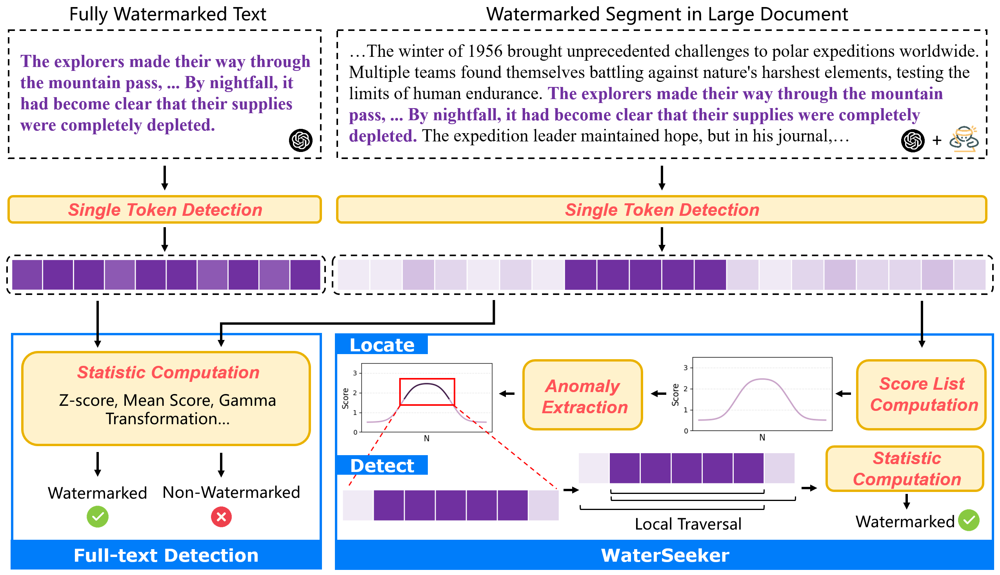

# WaterSeeker: Pioneering Efficient Detection of Watermarked Segments in Large Documents



### Dataset Construction

#### Construct your own datasets

In this repository, we provide `generate_data.py` to assist users in constructing their own dataset. We use the C4 dataset as the corpus for prompts, instructing large language models to generate watermarked segments with lengths between `min_length` and `max_length`. We then use Wikipedia corpus as natural text and randomly insert the watermarked segments into a position within the natural text to construct the data.

You can simply run the following command:

```shell
python -u generate_data.py --num_sample 300 \
    --wiki_start_index 0 \
    --prompt_start_index 0 \
    --watermark kgw \
    --key 33554393 \
    --model llama \
    --output_file data/main/kgw_llama.json
```

#### Use provided datasets

We provide the four datasets used in the main experiments: (under `data/`)

- KGW-llama  [key: 33554393]
- KGW-mistral [key: 4294967291]
- Aar-llama [seed: 42]
- Aar-mistral [seed: 42]

Each dataset employs different watermarking algorithms and Large Language Models (LLMs) for text generation, comprising 300 positive samples and 300 negative samples. Positive samples feature varying watermark strengths across segments. For the KGW algorithm, the parameter $\delta$ (represents watermark strength) is randomly selected from 2.0, 1.5, and 1.0. For the Aar algorithm, the temperature parameter (represents watermark strength) is randomly chosen from 0.5, 0.4, and 0.3.

For each sample in the provided dataset, the data format is as follows:

```
{
    "text": "... Today is a sunny day ...",
    "flag": 1, 
    "segments": list of tuples, indicating start and end indexes
    "strength": 2.0
}
```

flag: 1 indicates presence of watermark, 0 indicates absence

### Run WaterSeeker

#### Conda Environment

- Python 3.11
- Pytorch
- ```
  pip install -r requirements.txt
  ```

#### Shell

To use WaterSeeker for watermarked segments detection, run the following scripts:

```shell
python seeker/seeker.py --watermark kgw \
    --targeted_fpr 1e-6 \
    --input_file data/main/kgw_llama_10000.json \
    --output_file baseline_result/seeker_main/kgw_llama.log \
    --window_size 50 \
    --threshold_1 0.5 \
    --threshold_2 0.0 \
    --min_length 100 \
    --model llama \
    --key 33554393
```

```
python seeker/seeker.py --watermark kgw \
    --targeted_fpr 1e-6 \
    --input_file data/main/kgw_mistral_10000.json \
    --output_file baseline_result/seeker_main/kgw_mistral.log \
    --window_size 50 \
    --threshold_1 0.5 \
    --threshold_2 0.0 \
    --min_length 100 \
    --model mistral \
    --key 4294967291
```

```shell
python seeker/seeker.py --watermark aar \
    --targeted_fpr 1e-6 \
    --input_file data/main/aar_llama_10000.json \
    --output_file baseline_result/seeker_main/aar_llama.log \
    --window_size 50 \
    --threshold_1 0.5 \
    --threshold_2 0.0 \
    --min_length 100 \
    --model llama \
    --seed 42
```

```shell
python seeker/seeker.py --watermark aar \
    --targeted_fpr 1e-6 \
    --input_file data/main/aar_mistral_10000.json \
    --output_file baseline_result/seeker_main/aar_mistral.log \
    --window_size 50 \
    --threshold_1 0.5 \
    --threshold_2 0.0 \
    --min_length 100 \
    --model mistral \
    --seed 42
```

### Baselines

We also provide implementation of baselines mentioned in out paper:

| Baselines                        | Description                                                                                                                                                                                                                                                                  |
| -------------------------------- | ---------------------------------------------------------------------------------------------------------------------------------------------------------------------------------------------------------------------------------------------------------------------------- |
| Full-text Detection              | Calculate the detection statistic on the entire document.                                                                                                                                                                                                                    |
| WinMax                           | Traverse window size from 1 to a document length. For each window size, scan the entire document sequentially. During this process, calculate the statistical score for each window position and identify the highest score achieved across all windows. |
| Fix-length Sliding Window (FLSW) | Use a fixed-length window to traverse the entire document, calculating the detection statistic within each window. Select the windows that meet the specified criteria, then merge adjacent qualifying windows to generate the final detection and localization results.     |

You can try the baselines by running the following scripts:

```shell
# full-text
python baselines/full_text.py --watermark kgw \
    --input_file data/main/kgw_llama_10000.json \
    --output_file baseline_result/full_text/kgw_llama.log \
    --model llama \
    --key 33554393

# winmax
python baselines/winmax_parallel.py --watermark kgw \
    --input_file data/main/kgw_llama_10000.json \
    --min_window_length 1 \
    --max_window_length 10000 \
    --window_interval 1 \
    --key 33554393 \
    --output_file baseline_result/winmax_main/kgw_llama_1.log \
    --model llama \
    --num_workers 8

# flsw
python baselines/fix_window.py --watermark kgw \
    --input_file data/main/kgw_llama_10000.json \
    --targeted_fpr 1e-6 \
    --window_size 100 \
    --output_file baseline_result/flsw_main/kgw_llama_100.log \
    --model llama \
    --key 33554393
```

### Evaluation

We also provide an evaluation script that accepts a detection log file as input and outputs a dictionary in the following format:

```json
{
	"FPR": 0.000,
	"FNR": 1.000,
	"F1":  0.000,
	"Average iou": 0.000
}
```

```shell
python evaluate.py --watermark kgw \
    --input_file baseline_result/seeker_main/kgw_llama.log \
    --iou_threshold 0.0 \
    --detection_method seeker
```

### Citation

```
@inproceedings{pan-etal-2025-waterseeker,
    title = "{W}ater{S}eeker: Pioneering Efficient Detection of Watermarked Segments in Large Documents",
    author = "Pan, Leyi  and
      Liu, Aiwei  and
      Lu, Yijian  and
      Gao, Zitian  and
      Di, Yichen  and
      Wen, Lijie  and
      King, Irwin  and
      Yu, Philip S.",
    editor = "Chiruzzo, Luis  and
      Ritter, Alan  and
      Wang, Lu",
    booktitle = "Findings of the Association for Computational Linguistics: NAACL 2025",
    month = apr,
    year = "2025",
    address = "Albuquerque, New Mexico",
    publisher = "Association for Computational Linguistics",
    url = "https://aclanthology.org/2025.findings-naacl.156/",
    pages = "2866--2882",
    ISBN = "979-8-89176-195-7",
    abstract = "Watermarking algorithms for large language models (LLMs) have attained high accuracy in detecting LLM-generated text. However, existing methods primarily focus on distinguishing fully watermarked text from non-watermarked text, overlooking real-world scenarios where LLMs generate only small sections within large documents. In this scenario, balancing time complexity and detection performance poses significant challenges. This paper presents WaterSeeker, a novel approach to efficiently detect and locate watermarked segments amid extensive natural text. It first applies an efficient anomaly extraction method to preliminarily locate suspicious watermarked regions. Following this, it conducts a local traversal and performs full-text detection for more precise verification. Theoretical analysis and experimental results demonstrate that WaterSeeker achieves a superior balance between detection accuracy and computational efficiency. Moreover, its localization capability lays the foundation for building interpretable AI detection systems. Our code is available at https://github.com/THU-BPM/WaterSeeker."
}
```
